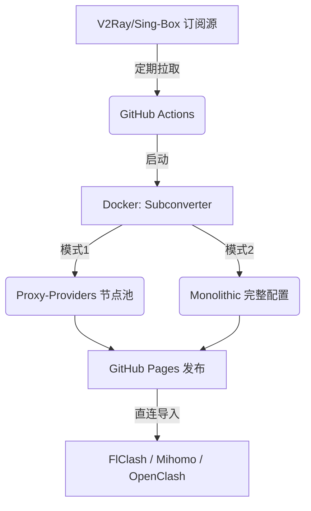

# V2Ray to Mihomo/Clash Converter 🚀

这是一个高度自动化的 GitHub 仓库模板，旨在通过 **GitHub Actions** 和 **Docker版 Subconverter**，将 V2Ray/Sing-Box 订阅源全自动转换为适用于 Mihomo (Clash Meta) 及 FlClash 的高级配置文件。

## 🌟 项目亮点

*   **完全自动化**：无需自行搭建后端，全程由 GitHub Actions 定时执行。
*   **双模式支持**：
    *   **Proxy-Provider 模式**：极速加载，生成专门的节点集合文件，即使上千节点也毫无压力。
    *   **Monolithic 模式**：单文件配置，方便基础客户端使用。
*   **内置 Loyalsoldier 规则集**：完美支持去广告、流媒体解锁、国内直连和全局路由。
*   **零代码修改**：通过 GitHub 环境自动注入域名，Fork 后只需修改 `config/source.txt` 即可运行！

## ⚙️ 工作原理

## 🚀 快速开始

### 1. Fork 本仓库
点击页面右上角的 `Fork` 按钮，将本仓库复制到你的账户下。

### 2. 修改订阅源
编辑 `config/source.txt`，将其中的默认链接替换为你自己的机场订阅链接（支持填写多行，会自动合并）。

### 3. 启用 GitHub Actions
*   进入你 Fork 后的仓库，点击顶部标签页的 **Actions**。
*   点击 **"I understand my workflows, go ahead and enable them"**。
*   在左侧选中 **Update Proxy Configuration**，点击右侧的 **Run workflow** 即可手动运行一次，进行初始转换。

### 4. 启用 GitHub Pages
*   点击顶部标签页的 **Settings** -> **Pages**。
*   在 **Build and deployment** 下的 **Source**，选择 **GitHub Actions**（如果不可选，请确保上一步已成功运行一次）。
*   注意：部署需要一点时间。完成之后，即可获得你的订阅链接。

---

## 🔗 获取订阅链接

你的专属配置链接格式如下（请将 `<username>` 和 `<repo>` 替换为你的 GitHub 用户名和仓库名）：

**推荐（Proxy-Provider 极速模式）：**
`https://<username>.github.io/<repo>/config.yaml`

**备选（传统单文件模式）：**
`https://<username>.github.io/<repo>/config_monolithic.yaml`

---

## 📱 客户端导入步骤

### FlClash / Mihomo / Clash Verge Rev
1. 打开客户端，进入 **配置 / Profiles** 页面。
2. 点击 **新建 / 导入**，选择 **URL导入**。
3. 填入你的 `config.yaml` 链接，并点击保存/下载。
4. 切换到此配置，进入 **代理 / Proxies** 页面，点击左上角的“测速”图标。
5. 在 `🚀 节点选择` 中选择 `♻️ 自动选择` 或你心仪的节点。

### OpenClash
1. 进入 OpenClash 控制面板，在 **配置订阅** 中新增。
2. 粘贴上述 `config.yaml` 链接。
3. 关闭“自动更新配置”（建议通过 GitHub Actions 处理更新，无需路由器承担）。
4. 保存配置并启动。

---

## 🛠 高级设置与进阶

### 更新频率说明
默认的更新频率为 **每 6 小时** 执行一次。
如需调整，请编辑 `.github/workflows/update.yml` 中的 `cron: '0 */6 * * *'`。

### 如何更换规则模板
本仓库使用 Loyalsoldier 的规则集。如果你想更改规则逻辑：
*   **Proxy-Provider 模式**：修改 `config/config_template.yaml` 即可。
*   **Monolithic 模式**：修改 `config/flclash.ini` 即可。

### 如何更换测速地址
本仓库默认使用 `https://cp.cloudflare.com/generate_204`，速度快且稳定。如需更换，在上述两份配置文件中搜索替换该地址即可。

### 如何增加策略组
在 `config/config_template.yaml` 的 `proxy-groups:` 列表中添加新项，然后在 `rules:` 列表中将其分配。

### 常见问题 / 故障排查
**Q1: Actions 执行失败，提示端口占用或启动超时？**
A1: Docker Subconverter 通常很稳定。如果偶尔失败，请点击 Actions -> 对应的失败任务 -> "Re-run all jobs" 重试。

**Q2: 客户端提示无法获取节点？**
A2: 请确保你在 GitHub Pages 设置中开启了服务，并且在浏览器中直接访问你的 `.yaml` 链接时能够正常显示配置内容。

## 📜 License
MIT License. 欢迎随时提交 PR 与建议！
