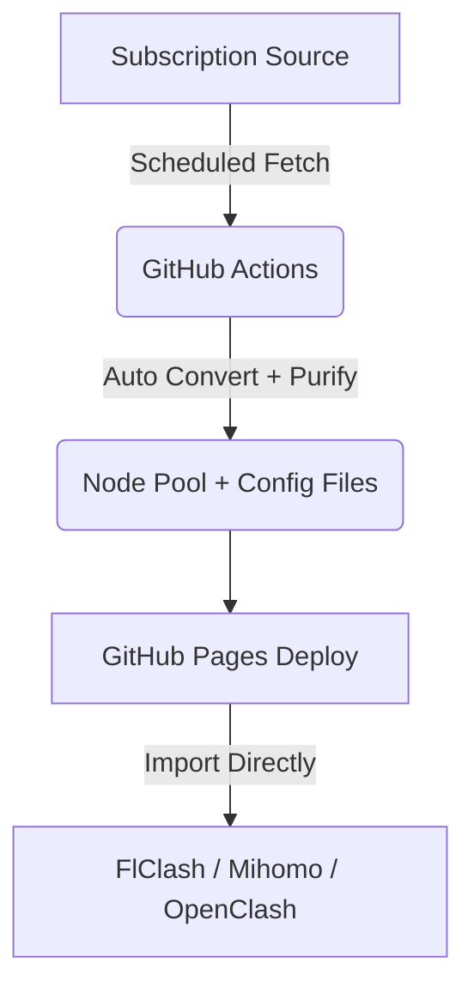

# V2Ray to Mihomo/Clash Converter 🚀

An automated GitHub repository template that converts V2Ray/Sing-Box subscription sources into optimized Mihomo (Clash Meta) and FlClash configuration files using **GitHub Actions** and **Docker Subconverter**.

## 🌟 Highlights

*   **Fully Automated**: No backend setup required. Runs entirely on GitHub Actions on a schedule.
*   **Dual Mode**:
    *   **Proxy-Provider Mode**: Fast-loading, separates node pool from config. Handles thousands of nodes effortlessly.
    *   **Monolithic Mode**: Single-file config for basic clients.
*   **Built-in Loyalsoldier Rulesets**: Ad-blocking, streaming media unlocking, China direct routing, and global routing out of the box.
*   **Zero Code Modification**: Just fork and edit `config/source.txt` — everything else is automatic.

## ⚙️ How It Works

## 🚀 Quick Start

### 1. Fork This Repository
Click the `Fork` button in the top-right corner to copy this repo to your account.

### 2. Edit Subscription Sources
Edit `config/source.txt` and replace the default URL with your own subscription links (one per line, they will be merged automatically).

### 3. Enable GitHub Actions
*   Go to the **Actions** tab in your forked repo.
*   Click **"I understand my workflows, go ahead and enable them"**.
*   Select **Update Proxy Configuration** from the left sidebar, then click **Run workflow** to trigger the first build.

### 4. Enable GitHub Pages
*   Go to **Settings** -> **Pages**.
*   Under **Build and deployment** -> **Source**, select **GitHub Actions** (if not available, run the workflow once first).
*   Deployment takes a moment. Once done, your subscription URLs will be ready.

---

## 🔗 Subscription URLs

Replace `<username>` and `<repo>` with your GitHub username and repository name:

**Recommended (Proxy-Provider Mode):**
`https://<username>.github.io/<repo>/config.yaml`

**Alternative (Monolithic Mode):**
`https://<username>.github.io/<repo>/config_monolithic.yaml`

---

## 📱 Client Setup

### FlClash / Mihomo / Clash Verge Rev
1. Open the client, go to **Profiles**.
2. Click **New / Import**, choose **URL Import**.
3. Paste your `config.yaml` URL, save/download.
4. Switch to this profile, go to **Proxies**, click the speed test icon.
5. In `🚀 节点选择`, select `♻️ 自动选择` or your preferred node.

### OpenClash
1. Go to OpenClash dashboard, add a new **Config Subscription**.
2. Paste the `config.yaml` URL.
3. Disable "Auto Update Config" (let GitHub Actions handle updates).
4. Save and start.

---

## 🌐 Region Detection & Smart Grouping

After importing the config, you will see:

- **Nodes auto-labeled with region prefixes**: `[HK]`, `[JP]`, `[US]`, etc. — you can tell where each node is located at a glance.
- **Policy groups auto-organized by region**: Country-specific groups like 🇭🇰 Hong Kong, 🇩🇪 Germany are generated automatically.
- **Large regions get their own group, small ones merge**: Regions with enough nodes get dedicated groups; sparse regions are consolidated into a single "🌍 Other Regions" group.
- **Auto-generated filter report**: Check `docs/filter_report.md` after each build for node count,存活率, and region distribution stats.

---

## 🛠 Advanced Settings

### Update Frequency
Default update interval is **every 1 hour**.
To change it, edit `.github/workflows/update.yml` and modify the `cron: '0 * * * *'` value.

### Custom Configurations
All editable config files are in the `config/` directory:
- **`config_template.yaml`**: Proxy-Provider mode policy groups, rules, and DNS settings
- **`flclash.ini`**: Monolithic mode policy groups and rulesets
- **`source.txt`**: Subscription source URLs

### Troubleshooting

**Q: Actions build fails?**
A: Go to Actions → failed job → click "Re-run all jobs" to retry.

**Q: Client can't fetch nodes?**
A: Make sure GitHub Pages is enabled and your `.yaml` URL returns content when opened in a browser.

## 🙏 Credits

Default subscription source from [ShatakVPN/ConfigForge-V2Ray](https://github.com/ShatakVPN/ConfigForge-V2Ray). Thanks to the author for providing high-quality aggregated nodes.

## 🤖 AI Generated

This project is entirely generated by AI (opencode + DeepSeek V4 Flash) and is intended solely for AI technology learning and practice purposes.

## 📜 License
GNU General Public License v3.0. PRs and suggestions welcome!
